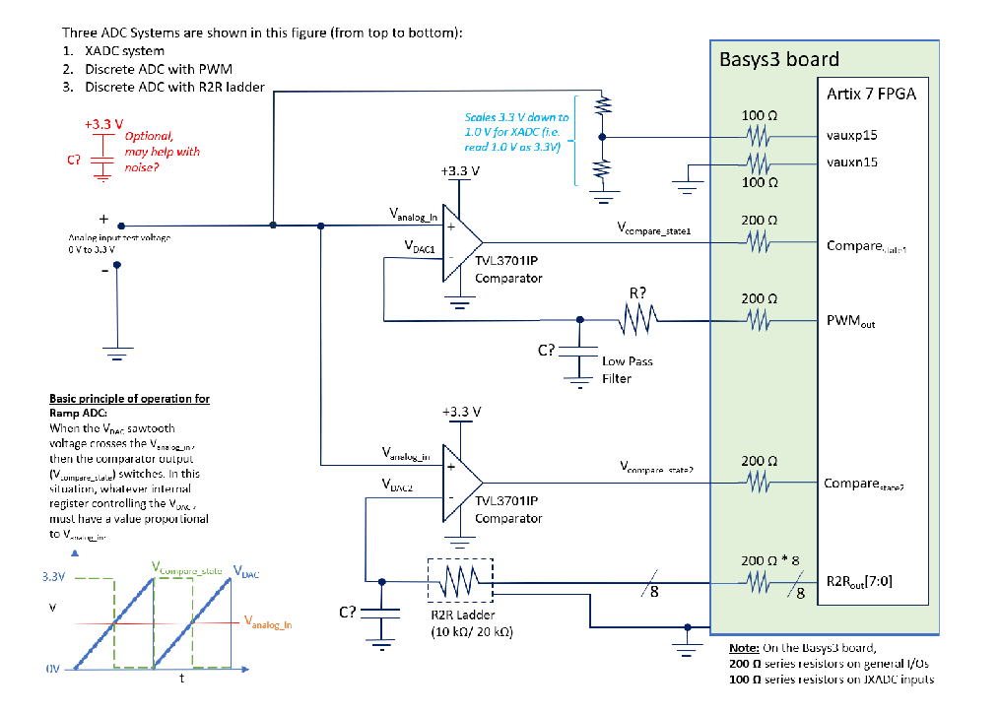

## Features
- Dual discrete ADC implementations:
  - PWM ramp-compare ADC with external RC filter
  - R-2R ladder ramp-compare ADC
- Successive Approximation Register (SAR) ADC mode using comparator feedback
- Built-in XADC reference path for performance validation and auto calibration
- Moving-average digital filtering
- Real-time 4-digit 7-segment display output (HEX or scaled decimal mV)
- Mode selection between XADC, PWM ADC, and R-2R ADC
- Debug LEDs for comparator monitoring
- Clock-optimized design using Vivado PLL with positive timing slack (WNS)
- Parameterized modules for easy resolution and timing reconfiguration

## Schematic

